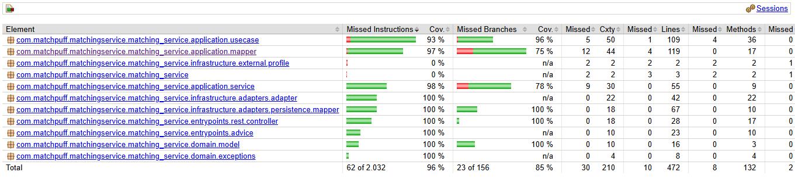

# matchpuff-matching-service

## Algoritmo de matching y gestión de afinidad entre usuarios

### Tecnologías utilizadas
- Java 21
- Spring Boot 3.4.5
- Maven
- MongoDB (Spring Data MongoDB)
- Lombok
- MapStruct
- SpringDoc OpenAPI (Swagger UI)
- Spring Security
- JaCoCo

### Descripción del módulo
Este microservicio gestiona el proceso de matching entre usuarios de la plataforma Matchpuff, calculando scores de afinidad basados en intereses comunes, programa académico y disponibilidad horaria, siguiendo principios de Clean Architecture y arquitectura hexagonal.

### Funcionamiento del módulo
- Arquitectura hexagonal (Ports & Adapters): dominio, aplicación, infraestructura y entrypoints.
- El algoritmo de afinidad opera en tres dimensiones: intereses (40%), programa académico (30%) y horario (30%).
- Los intereses se evalúan en tres niveles: coincidencia de categorías, cruce nombre-categoría y compatibilidad de género.
- Utiliza DTOs, mapeadores MapStruct y puertos de dominio para mantener las capas desacopladas.
- Otros módulos pueden consumir sus endpoints REST para crear y consultar matches.

### Diagramas
- Diagrama de clases: [pendiente de agregar]
- Diagrama de componentes: [pendiente de agregar]
- Diagrama de datos: [pendiente de agregar]

### Documentos

- Documento arquitectura del módulo: [pendiente de agregar]

### Funcionalidades
- Creación de matches entre dos usuarios con estado inicial `PENDING`
- Consulta de match por ID
- Consulta de todos los matches de un usuario (como solicitante o destinatario)
- Actualización del estado del match (`ACCEPTED` / `REJECTED`)
- Eliminación de match
- Cálculo de score de afinidad compuesto (intereses, académico, horario)

### Endpoints expuestos

#### `POST /api/v1/matches` — Crear un match

Crea un nuevo match entre dos usuarios. El estado inicial es `PENDING` y el score de afinidad se calcula automáticamente.

**Request body:**
```json
{
  "requesterId": "550e8400-e29b-41d4-a716-446655440000",
  "targetId":    "550e8400-e29b-41d4-a716-446655440001"
}
```

**Happy Path — `201 Created`:**
```json
{
  "idMatch":     "a1b2c3d4-e5f6-7890-abcd-ef1234567890",
  "requesterId": "550e8400-e29b-41d4-a716-446655440000",
  "targetId":    "550e8400-e29b-41d4-a716-446655440001",
  "status":      "PENDING",
  "affinityScore": {
    "score":         0.72,
    "interestScore": 0.65,
    "academicScore": 0.80,
    "scheduleScore": 0.75
  },
  "createdAt": "2024-05-05T10:30:00",
  "updatedAt": "2024-05-05T10:30:00"
}
```

---

#### `GET /api/v1/matches/{id}` — Obtener match por ID

**Happy Path — `200 OK`:**
```json
{
  "idMatch":     "a1b2c3d4-e5f6-7890-abcd-ef1234567890",
  "requesterId": "550e8400-e29b-41d4-a716-446655440000",
  "targetId":    "550e8400-e29b-41d4-a716-446655440001",
  "status":      "ACCEPTED",
  "affinityScore": {
    "score":         0.72,
    "interestScore": 0.65,
    "academicScore": 0.80,
    "scheduleScore": 0.75
  },
  "createdAt": "2024-05-05T10:30:00",
  "updatedAt": "2024-05-05T11:00:00"
}
```

---

#### `GET /api/v1/matches/user/{userId}` — Obtener matches de un usuario

Retorna todos los matches donde el usuario aparece como solicitante o como destinatario.

**Happy Path — `200 OK`:** devuelve un arreglo de matches con la misma estructura que `GET /api/v1/matches/{id}`.

---

#### `PATCH /api/v1/matches/{id}/status` — Actualizar estado de un match

Permite aceptar o rechazar un match pendiente.

**Request body:**
```json
{
  "status": "ACCEPTED"
}
```

**Valores aceptados para `status`:**
| Valor | Descripción |
|---|---|
| `PENDING` | Match creado, esperando respuesta |
| `ACCEPTED` | Match aceptado por el destinatario |
| `REJECTED` | Match rechazado por el destinatario |

**Happy Path — `200 OK`:** devuelve el match completo con el estado actualizado y `updatedAt` renovado.

---

#### `DELETE /api/v1/matches/{id}` — Eliminar un match

**Happy Path — `204 No Content`:** sin cuerpo de respuesta.

---

### Algoritmo de afinidad

El score total se calcula combinando tres dimensiones:

```
totalScore = 40% × interestScore + 30% × academicScore + 30% × scheduleScore
```

| Dimensión | Peso | Cómo se calcula |
|---|---|---|
| **Intereses** | 40% | 30% categoría + 50% nombre→categoría + 20% género |
| **Académico** | 30% | 60% carrera (binario) + 40% proximidad de semestre |
| **Horario** | 30% | Similitud de Jaccard sobre slots de 30 minutos por día |

**Niveles de interés:**
- **Nivel 1 — Categoría:** similitud de Jaccard entre las categorías de los tags de ambos usuarios.
- **Nivel 2 — Nombre → Categoría:** detecta cuando el nombre de un tag de A coincide con la categoría de B (y viceversa). Ejemplo: A tiene `name="Voleibol"` y B tiene `category="Voleibol"`.
- **Nivel 3 — Género:** compatibilidad mutua de preferencias de género. Ambos se aceptan → `1.0`, solo uno → `0.5`, ninguno → `0.0`.

---

### Valores aceptados en los modelos relacionados

| Campo | Valores |
|---|---|
| `status` | `PENDING`, `ACCEPTED`, `REJECTED` |
| `career` | `SYSTEMS_ENGINEERING`, `COMPUTER_SCIENCE`, `INFORMATION_TECHNOLOGY`, `ADMINISTRATION`, `BUSINESS` |
| `gender` | `MALE`, `FEMALE`, `NON_BINARY`, `OTHER` |
| `dayOfWeek` | `MONDAY`, `TUESDAY`, `WEDNESDAY`, `THURSDAY`, `FRIDAY`, `SATURDAY`, `SUNDAY` |

---

### Manejo de errores

Todos los errores devuelven la siguiente estructura:
```json
{
  "message":   "Descripción del error",
  "status":    400,
  "timestamp": "2024-05-05T10:30:00"
}
```

| Situación | Código HTTP | Mensaje de ejemplo |
|---|---|---|
| Campo inválido o faltante (`@NotNull`, `@Valid`, etc.) | `400 Bad Request` | `"requesterId: El ID del solicitante es requerido"` |
| Match ya existe entre los dos usuarios | `400 Bad Request` | `"Ya existe un match entre estos dos usuarios"` |
| Estado de match inválido | `400 Bad Request` | `"status: El estado del match es requerido"` |
| Match no encontrado | `404 Not Found` | `"Match no encontrado con ID: <id>"` |
| Error interno del servidor | `500 Internal Server Error` | `"Error interno del servidor"` |

### Mensajería
- Pendiente por hablar

### Evidencia de pruebas
-

### Ejecución del proyecto
1. Clonar el repositorio
2. Configurar las variables de entorno:
   - `MONGO_URI`: URI de conexión a MongoDB
   - `MONGO_DB` (opcional, default: `matchingservice`): nombre de la base de datos
3. Ejecutar `mvn clean install`
4. Ejecutar la aplicación con `mvn spring-boot:run` o desde la clase principal
5. La documentación Swagger estará disponible en `http://localhost:8080/swagger-ui.html`

### Evidencia de despliegue CI/CD
-

### Organización del código
El código está organizado en las siguientes carpetas:
- `application`: Lógica de aplicación, DTOs, servicios (interfaces), use cases (implementaciones), mapeadores
- `domain`: Modelos de dominio, excepciones, puertos de entrada (`ports/in`) y salida (`ports/out`)
- `infrastructure`: Adaptadores de persistencia, entidades MongoDB, mapeadores de persistencia, repositorios Spring Data, configuración
- `entrypoints`: Controladores REST, mapeadores REST, WebSocket, advice (manejo global de errores)

### Documentación del código
- Cada función, propiedad y clase debe tener comentarios de documentación.

### Conexiones con servicios externos
- MongoDB: base de datos principal para persistencia de matches y perfiles de matching (URI configurada mediante variable de entorno `MONGO_URI`)

### Pruebas y cobertura

### JACOCO



### SONAR CUBE

### Pipelines
- El repositorio debe tener dos pipelines: uno de desarrollo y otro de producción.

---
*En proceso :<.*
# matchpuff-social-matching-service
Lógica de matching y social: conexiones, recomendaciones e interacciones entre usuarios.
